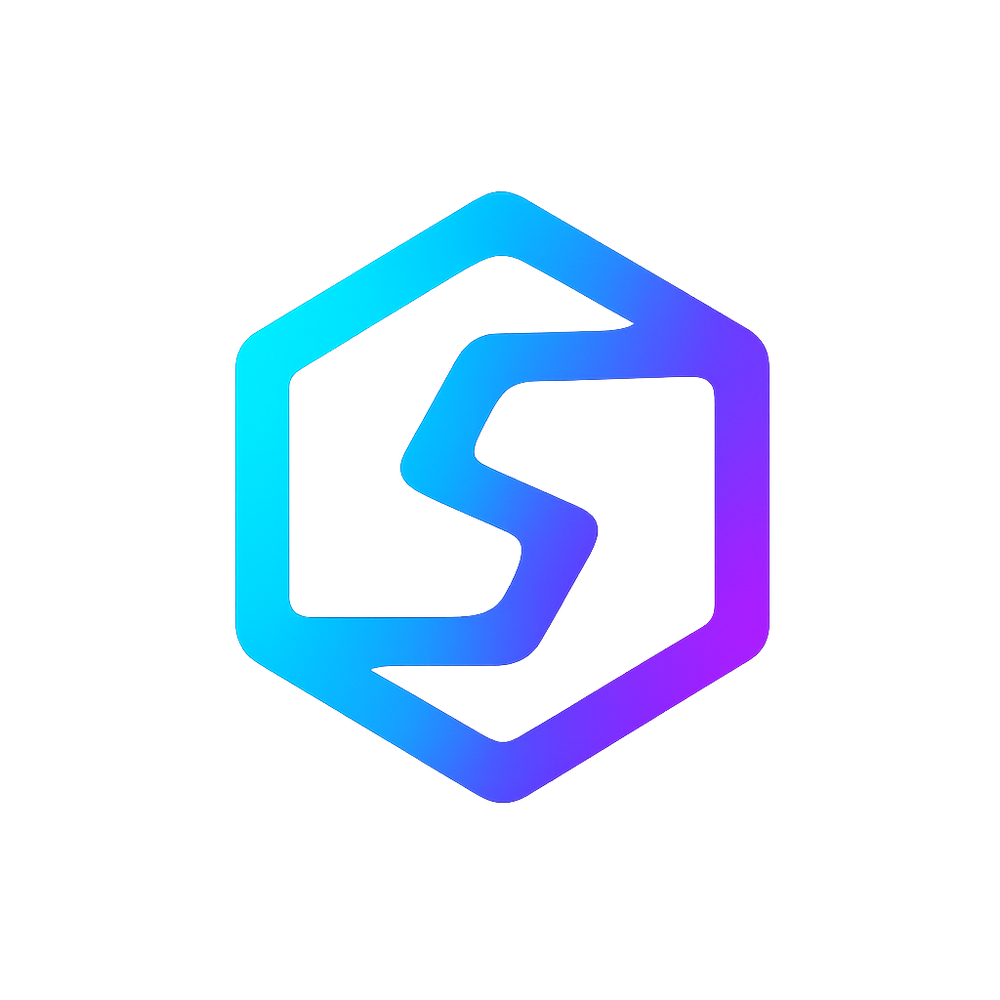

# NextIA Landing Page

Bienvenido al repositorio de la **Landing Page de NextIA** — soluciones avanzadas de inteligencia artificial, automatización y visión por computadora para empresas.

<div align="center">
  
</div>

## 🚀 Descripción

Esta landing es la puerta de entrada a nuestra propuesta de valor: consultoría, desarrollo e integración de IA personalizada para empresas de todos los tamaños. Presenta nuestros servicios, proyectos, equipo y datos de contacto.

- **Diseño responsive**
- **Modo claro/oscuro**
- **Animaciones modernas**
- **Integración con CDN de Tailwind y Font Awesome**
- **Código simple, editable y mantenible**

---

## 🖥️ Vista previa


---

## 📂 Estructura del repositorio

```plaintext
nextia-landing/
├── assets/
│   ├── css/
│   │   └── output.css
│   ├── images/
│   │   ├── logo/
│   │   │   └── logo_nextia.webp
│   │   ├── hero/
│   │   │   └── nextia_main.avif
│   │   └── about/
│   │       └── nextia_2.avif
│   └── videos/
│       └── hqdefault.jpg
├── index.html
└── README.md

⚡ Cómo usar
Clona el repositorio

bash
Copiar
Editar
git clone https://github.com/Nextia-labs/nextia-landing.git
Abre index.html en tu navegador.

No requiere instalación de dependencias ni servidor backend.

El diseño se apoya en Tailwind CDN y Font Awesome CDN.

Edición

Edita index.html y los assets para personalizar textos, imágenes o colores.

🌗 Cambiar a modo oscuro
Haz clic en el botón 🌙 (o ☀️) arriba a la derecha para alternar entre modo claro y oscuro.
La preferencia queda guardada localmente.

📌 Notas
No incluye dependencias ni build tools: todo es HTML/CSS estándar, para facilitar la edición y el deploy.

¿Quieres agregar más secciones? Duplica/modifica bloques de HTML según tus necesidades.

Para producción: recomendamos servir desde un hosting estático (Netlify, Vercel, GitHub Pages, etc.).

🛠️ Tecnologías usadas
Tailwind CSS (CDN)

Font Awesome (CDN)

HTML5 + CSS3

📬 Contacto
¿Consultas, mejoras o sugerencias?
Escribe a contacto@nextia.com o abre un Issue en este repositorio.

<div align="center"> <b>NextIA - Impulsando negocios con inteligencia artificial</b> </div>